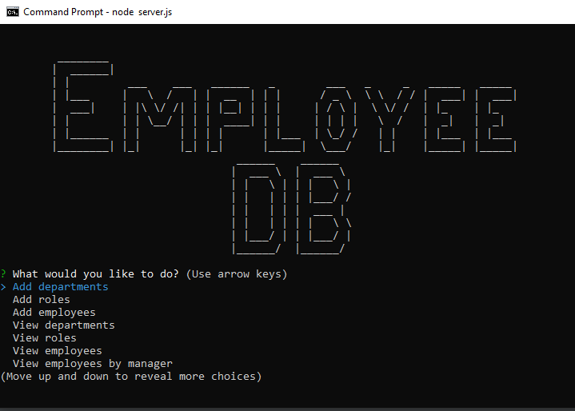

# EmployeeDB
Employee DB (Content Management System)
An interfaces that make it easy for non-developers to view and interact with information stored in databases.

## Features
A command-line application that at a minimum allows the user to:

  * Add departments, roles, employees

  * View departments, roles, employees

  * Update employee roles

Bonus points if you're able to:

  * Update employee managers

  * View employees by manager

  * Delete departments, roles, and employees

  * View the total utilized budget of a department -- ie the combined salaries of all employees in that department
  ### Home Screen
  
  

Include a `seed.sql` file to pre-populate your database.